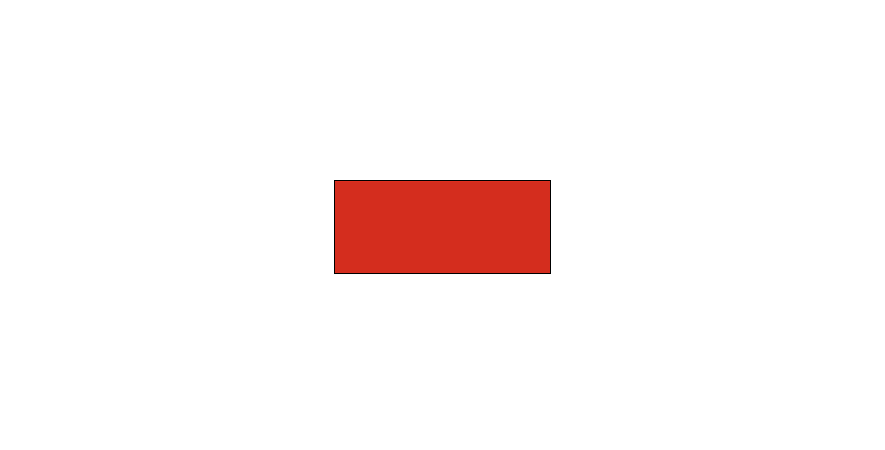
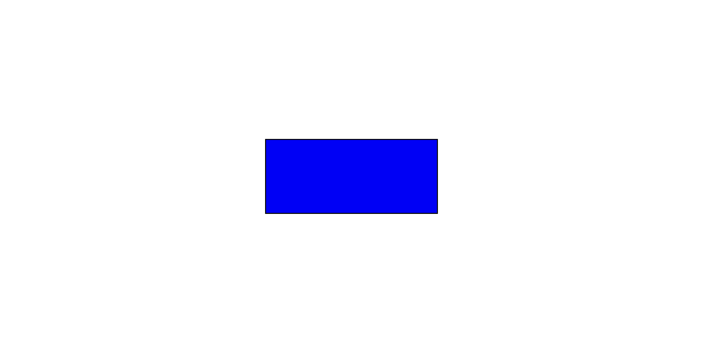

# JavaScript Project: Dynamic Color-Changing Rectangle
In this basic JavaScript project, we have a central rectangle on the screen, and as you move the mouse from the left end to the right, its color transitions from red to blue. The color change is designed so that the red color intensity is highest at the leftmost corner, gradually diminishing towards the center, while the center exhibits the least intense blue. As you continue to the right side, the blue color's intensity gradually increases.

# Deployed Link
https://dynamic-color-changing-rectangle.netlify.app/

# Screenshots

---

---

---

